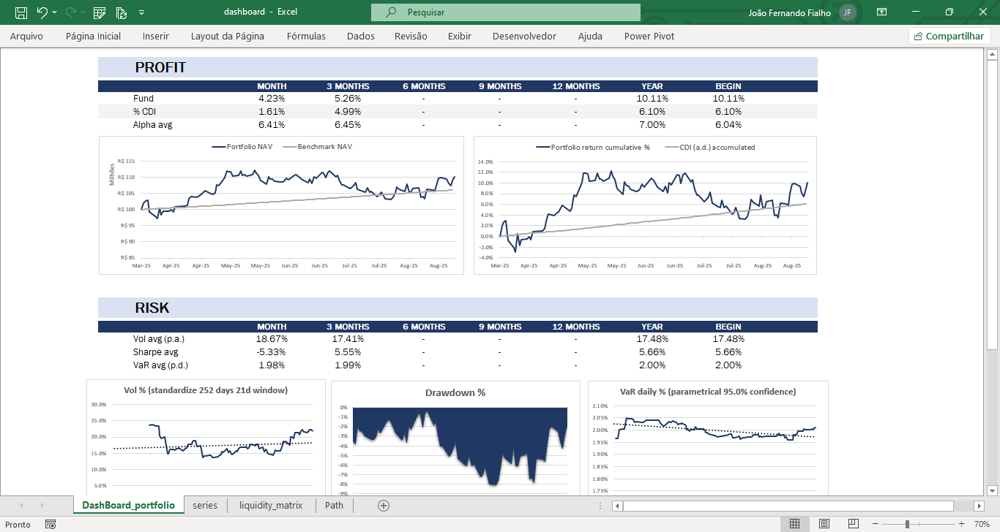

# Relatório de Risco/Performance para Fundos de Investimentos (UFFinance)


#
## Descrição

Este projeto foi desenvolvido para automatizar a geração de relatórios de risco para o fundo de investimento da UFFinance - Liga de Mercado Financeiro da UFF.

Permite aos analistas avaliarem métricas de risco importantes historicamente: volatilidade, *drawdown*, VaR (Value at Risk) e liquidez do fundo.


O sistema é modular, facilitando a adição de novas funcionalidades. Ele processa dados da carteira fornecida em arquivo Excel, realiza cálculos de risco e exporta os resultados em formato CSV.


#
## Exemplo de relatório

Basta inserir o seu portfólio em input e rodar o código em `main.py`. Arquivos CSV serão criados na pasta `outputs` que alimentarão o relatório excel via Power Query.





#
## 📁Estrutura do Projeto

Visão geral dos principais diretórios e arquivos:

```
.
├── main.py
│
├── dashboards/
│   └── RiskDashboard.xlsx
│
├── inputs/
│   └── portfolio1.xlsx
│
├── outputs/
│   ├── liquidity_matrix.csv
│   └── series.csv
│
└── src/
    ├── assistants/
    │   └── read_portfolio.py
    ├── complete_report.py
    └── functions.py
```

*   `main.py`: O script principal que orquestra a leitura dos dados da carteira, a geração dos relatórios de risco e a exportação dos resultados.
*   `complete_report.py`: Contém a lógica para calcular as diversas métricas de risco (volatilidade, drawdown, VaR, matriz de liquidez) e exportar os resultados para arquivos CSV.
*   `functions.py`: Contém a classe `Portfolio` utilizada para simular uma carteira ao longo do tempo.
*   `read_portfolio.py`: Ler os dados da carteira a partir de arquivos Excel.

* `RiskDashboard.xlsx`: Dashboard em Excel utilizado para visualizar os resultados gerados.


## ▶️ Configuração do Ambiente

Antes de executar, crie um ambiente virtual (venv). Certifique-se de ter o (Python >= 3.12) instalado.
1.  **Crie um ambiente virtual, digite no terminal:**
    ```bash
    python -m venv venv
    ```

2.  **Ative o ambiente virtual:**
    *   No Windows:
        ```bash
        .\venv\Scripts\activate
        ```
    *   No macOS/Linux:
        ```bash
        source venv/bin/activate
        ```

3.  **Instale as dependências necessárias:**
    ```bash
    pip install -r requirements.txt
    ```

## ▶️ Como Executar

Com o ambiente configurado e as dependências instaladas. Para gerar o relatório de risco:


1.  **Prepare os arquivos de entrada**: Coloque seus arquivos de carteira de investimento (no formato `.xlsx`) no diretório `inputs/`. Certifique-se de que o arquivo Excel contenha as colunas 'tickers' e 'weights'.

2.  **Configure o `main.py`**: Abra o arquivo `main.py` e ajuste as variáveis `start` e `portfolio` de acordo com suas necessidades. A variável `start` define a data de início para a análise, e `portfolio` deve corresponder ao nome do arquivo da sua carteira (sem a extensão `.xlsx`). Você também pode ajustar o `name` do relatório e o `portfolio_value` na chamada da função `risk_report`.

    Exemplo de configuração em `main.py`:
    ```python
    start = '2025-04-01'
    portfolio = 'portfolio2'
    # ...
    p1_report = general_report(p1_t, p1_w, start, name="semana1", portfolio_inicial_value=100000000)
    ```

3.  **Execute o script principal**:
    ```bash
    python main.py
    ```

4.  **Resultado**: Os dados gerados serão salvos, em CSV, no diretório `outputs/`. Você encontrará arquivos como `{name}_liquidity_matrix.csv` e `{name}_series.csv` (o prefixo é `name` configurado no `main.py`).


#
## 👨‍💻 Autor
* João Fernando
* LinkedIn: https://www.linkedin.com/in/joaoffialho/
